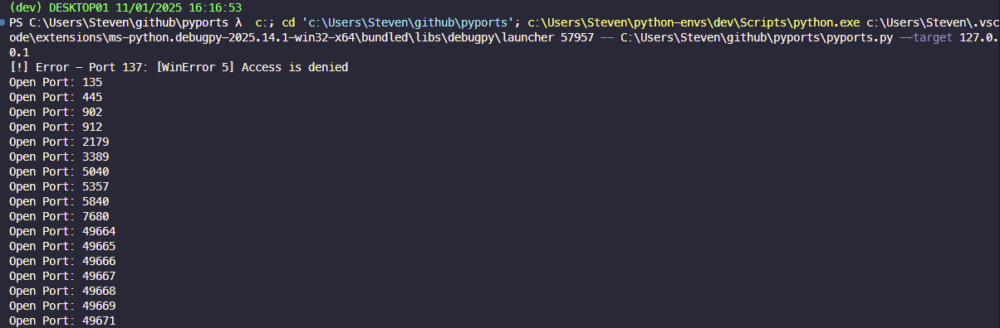

# pyports
Simple python program to scan a host, identifying any open ports. 

# TODO: 
    - logic to scan specific ports
    - option to scan common ports associated with AD DCs
    - save results to text file to feed to nmap: open-ports.txt
    - add functions to determine service details? 
    - make a C2 and incorporate the scanner as a module? 
    - logic for firewalls and filtered responses? 
